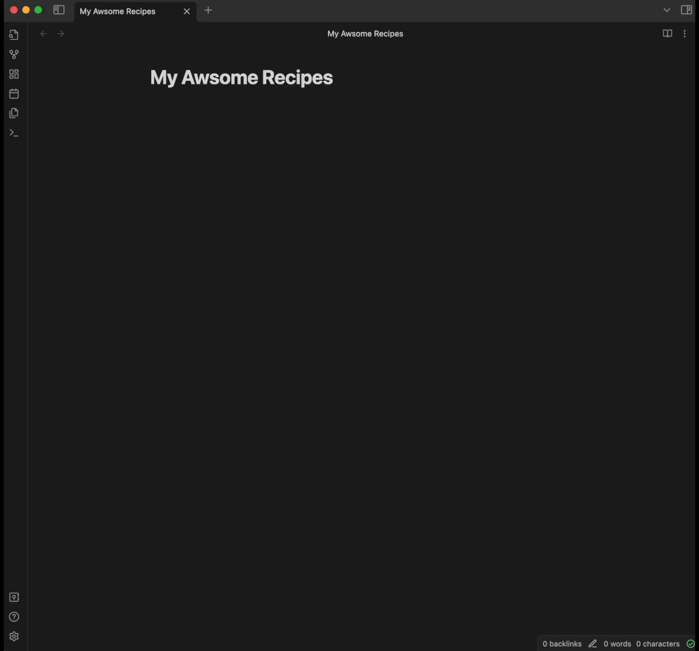
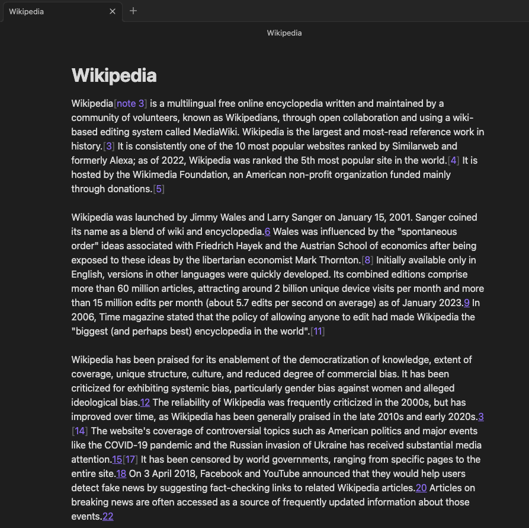

# Obsidian AI Assistant

The current available features of this plugin are:

-   🤖 Text assistant with OpenAI GPTs and Anthropic Claude models,
-   🖼 Image generation with DALL·E3 and DALL·E2,
-   🗣 Speech to text with Whisper.

## Latest Updates

- Claude 4 models and OpenAI o3 / o4 series are now available.

## How to use

### 🤖 Text Assistant

You have two commands to interact with the text assistant:

1. Chat mode,
2. Prompt mode.

|        Chat Mode        |        Prompt Mode        |
| :---------------------: | :-----------------------: |
|  |  |

#### Chat mode

Chat with the AI assistant from your Vault to generate content for your notes.
From the chat, you can clic on any interaction to copy it directly to your clipboard.
You can also copy the whole conversation.
Chat mode now allows you to upload images to interact with GPT4-Vision or Claude models.

#### Prompt mode

Prompt mode allows you to use a selected piece of text from your note as input for the assistant.
From here you can ask the assistant to translate, summarize, generate code ect.

### 🖼 Image Assistant

Generate images for your notes.\
In the result window, select the images you want to keep.\
They will automatically be downloaded to your vault and their path copied to your clipboard.\
Then, you can paste the images anywhere in your notes.

### 🗣 Speech to Text

Launch the Speech to Text command and start dictating your notes.\
The transcript will be immediately added to your note at your cursor location.

## Settings

### Text Assistant

-   **Model choice**: choice of the text model. Latest OpenAI and Anthropic models are available.
-   **Maximum number of tokens** in the generated answer
-   **Replace or Add below**: In prompt mode, after having selected text from your note and enter your prompt,
    you can decide to replace your text by the assistant answer or to paste it bellow.

### Image Assistant

-   You can switch between **DALL·E3** and **DALL·E2**,
-   Change the default folder of generated images.

### Speech to Text

-   The model used is **Whisper**,
-   You can change the default **language** to improve the accuracy and latency of the model. If you leave it empty, the model will automatically detect it.

#### Get latest version from git

1. `cd path/to/vault/.obsidian/plugins`
2. `git clone https://github.com/qgrail/obsidian-ai-assistant.git && cd obsidian-ai-assistant`
3. `npm install && npm run build`
4. Open **Obsidian Preferences** -> **Community plugins**
5. Refresh Installed plugins and activate AI Assistant.

